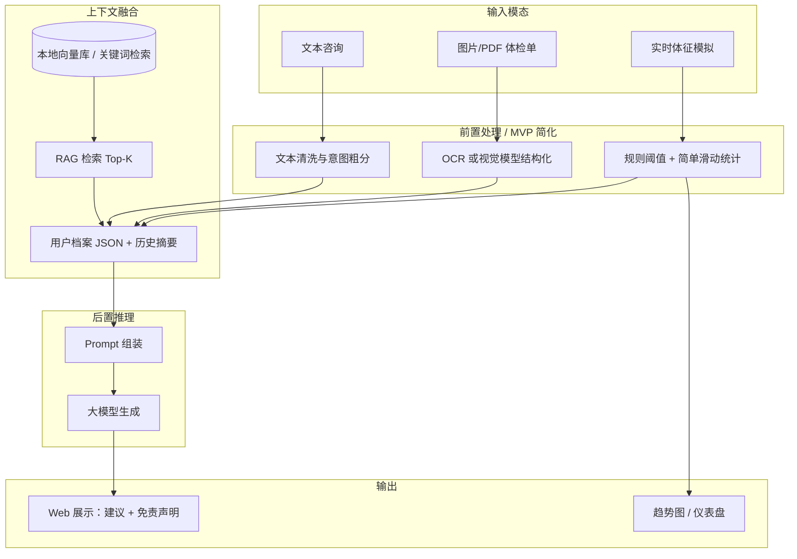
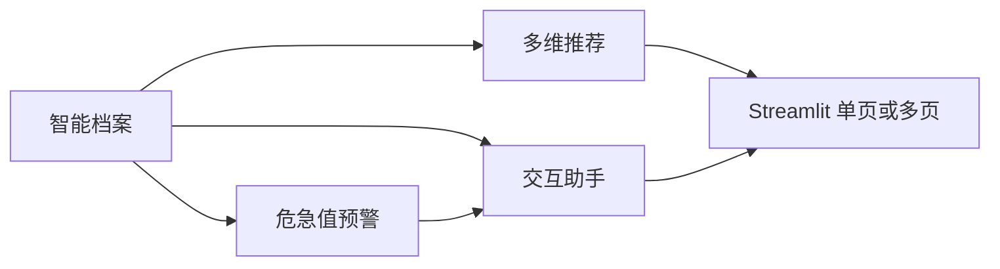

# 项目名称：基于多模态大模型的个性化全周期健康管理与智能预警平台

**Project ID:** AI-Health-Guardian-Pro  

**课程大作业定位：** 本地可演示的 MVP（Minimum Viable Product），不依赖云服务器租赁，零或极低外部成本，重点展示**架构思想 + 多模态链路 + 可解释输出**，非临床级产品。

---

## 1. 核心设计哲学 (Design Philosophy)

本系统采用「**前置流处理 + 后置多模态推理**」的架构思想。

- **高性能接入（完整版愿景）：** 利用 Golang 处理高频实时体征（ECG/心率/血氧）。
- **多模态理解：** 结合视觉大模型 / OCR 解析体检单与简单医学影像示意。
- **知识闭环：** 通过 RAG（检索增强生成）挂载**小规模、可审计**的医学科普知识片段，降低胡编风险。

**MVP 原则：** 完整版中的 Golang、独立时序库、高并发网关等在作业中**降级为本地模拟或 Python 单进程**，保留**数据流与模块边界**以便答辩时对照架构图说明「若上线如何演进」。

---

## 2. 与流程图对应的系统视图

> 若后续在 `Design/figures/` 下补充 PNG/SVG，可用相对路径插入；当前用 Mermaid 与文字描述对齐「模态分流 → 融合 → Prompt → 输出」逻辑。

### 2.1 总体数据流（对应「实现逻辑流」）



### 2.2 模块依赖关系（对应「功能模块」）



---

## 3. 架构：完整愿景 vs 本地 MVP 对照

| 层级 / 组件 | 完整版（论文级描述） | **本地 MVP（本作业采用）** | 说明 |
|---------------|----------------------|----------------------------|------|
| 流处理 | Golang + 消息队列 | **Python 定时生成/读取 CSV 或内存队列** | 演示「信号进入→规则初筛」即可 |
| 时序存储 | InfluxDB / TDengine | **SQLite 单表 + 时间戳** 或 **Pandas 内存** | 足够画简单趋势图 |
| 关系库 | PostgreSQL | **SQLite** | 单文件，免安装服务 |
| 网关 | REST/gRPC 高并发 | **无独立网关**，Streamlit 回调直接调函数 | 降低运维成本 |
| 视觉 / OCR | 云端多模态 API | **任选其一：** 本地轻量 OCR（如 `pytesseract`）+ 规则解析；或**课程允许的 API**（注意密钥与费用） | 答辩说明「接口可替换」 |
| 大模型 | 专用推理服务 | **Ollama 本地模型**（零 API 费）或**免费额度 API** | 以课程要求为准 |
| RAG | FAISS 大规模库 | **几十～几百条 Markdown/JSON 知识条** + `sentence-transformers` 或关键词 BM25 | 强调可追溯引用片段 |

---

## 4. 功能模块详细计划（MVP 可交付范围）

### 模块 1：智能档案 (Smart Profiling)

- **实现路径：** 上传 PDF/图片 → OCR/手工字段 → 写入 SQLite（脱敏演示数据）。
- **AI 任务：** 从文本中抽取若干结构化字段（如肝功、血脂项名称与数值）；**规则 + LLM 辅助**标出「相对参考范围偏高/偏低」（参考范围可写死在配置表）。
- **MVP 裁剪：** 不做全院级 EMR 对接；**1～2 份示例报告 + 用户可再上传 1 份**即可。

### 模块 2：多维推荐 (Multi-dimensional Recommendation)

- **实现路径：** 基于身高体重年龄算 BMR（公式即可）+ 用户勾选活动量/饮食偏好。
- **输出：** 生成**可编辑的**一日建议（热量区间、三大营养素比例、运动时长建议），由 LLM **润色表述**并附**非医疗承诺**说明。
- **MVP 裁剪：** 不做可穿戴真实同步；用**滑块/单选**模拟「今日步数等级」。

### 模块 3：危急值预警 (Emergency Warning)

- **逻辑：**
  - **判定 A：** 模拟体征序列是否连续越过阈值（如心率、血氧——用 CSV 或随机游走 + 注入异常段）。
  - **判定 B：** LLM 仅作「自然语言解释」，**最终是否告警以规则引擎为准**（避免模型随意判危重）。
- **响应：** Streamlit **弹窗/醒目 `st.error` 横幅** + 文案提示「演示环境，非急救通道」；**不做**真实短信/App 推送。
- **MVP 裁剪：** 紧急联系人可存 SQLite，**仅展示「将通知某某」**，不真发。

### 模块 4：交互式 AI 助手 (Interactive Assistant)

- **特性：** 多轮对话；回答前注入 RAG 检索到的短条文；**禁止**输出诊断结论时可加系统提示词约束。
- **安全保障：** 每条助手回复底部固定展示**医学免责声明**（课程与法律风险说明）。

---

## 5. 开发逻辑流（答辩叙事）

1. **模态判定**
   - 文本 → 直接进入交互助手流。
   - 图片/PDF → 视觉/OCR 分支 → 结构化 JSON。
   - 实时信号 → **MVP：** Python 读取模拟流 → 写 SQLite / 内存 → 规则初筛。
2. **信息融合：** 历史档案摘要 + 当前模态结构化结果 + 用户当前问题。
3. **Prompt 组装：** 角色（科普级健康助手）+ 约束（不替代面诊、引用知识库片段）+ 数据（JSON）。
4. **输出分发：** 表格/趋势图（Plotly 或 Streamlit 原生）+ 自然语言建议 + 免责声明。

---

## 6. 技术栈与目录建议（最低成本）

| 用途 | 推荐选型 | 成本 |
|------|-----------|------|
| 前端 + 轻逻辑 | **Streamlit** | 免费 |
| 语言 | Python 3.10+ | 免费 |
| 数据 | SQLite + 可选 CSV 样本 | 免费 |
| 本地 LLM（可选） | Ollama + 较小开源模型 | 免费（占用本机 GPU/CPU） |
| 向量检索（可选） | `chromadb` 或 FAISS 内存索引 | 免费 |

**建议仓库结构（示例）：**

```text
MedAi/
  app.py                 # Streamlit 入口
  pages/                 # 多页时使用 streamlit multipage
  core/
    rules.py             # 阈值与危急值规则
    rag.py               # 加载知识库 + 检索
    llm_client.py        # 统一封装本地/API
    ingest_report.py     # OCR + 结构化
  data/
    samples/             # 脱敏示例体检单、体征 CSV
    knowledge/           # RAG 用短文档
  db.sqlite              # 本地数据库（可 gitignore）
  Design/
    Design.md
    figures/             # 可选：导出架构图放此处
```

---

## 7. 本地运行与展示（无需服务器）

1. 创建虚拟环境，`pip install streamlit pandas ...`（`sqlite3` 为 Python 标准库；其余依赖按实现补充）。
2. 终端执行：`streamlit run app.py`，浏览器自动打开 `http://localhost:8501`。

---

## 8. 里程碑

| 阶段 | 目标 | 验收 |
|------|------|------|
| Step1 | SQLite 档案 + 模拟体征 + 规则预警 + 基础 Streamlit 布局 | 能上传/录入并看到趋势与告警 UI |
| Step2 | RAG + 助手对话 + 免责声明 | 回答中带可点击/可展示的引用片段 |
| Step3 | 体检单 OCR/解析 + 推荐模块润色 + 打磨 UI 与答辩稿 | 端到端演示脚本跑通 |

---

## 9. 风险、伦理与课程合规

- **非医疗器械声明：** 本项目仅为课程作业，**不提供诊断、治疗或急救决策**。
- **隐私：** 使用合成或公开脱敏数据集；演示账号不使用真实患者信息。
- **API 密钥：** 若使用商用 API，**勿提交密钥到 Git**；优先本地模型以满足「低成本」目标。

---

## 10. Streamlit 入口逻辑参考（伪代码）

与最初设想一致，仅补充异常分支与 RAG/规则调用占位，便于直接落地编码。

```python
# app.py 逻辑伪代码
import streamlit as st
# import core.rag, core.llm_client, core.rules, core.ingest_report

st.set_page_config(page_title="AI 全周期健康管理（课程演示）", layout="wide")
st.title("AI 全周期健康管理平台 — MVP")

with st.sidebar:
    mode = st.radio("选择数据模态", ["文字咨询", "体检报告", "实时体征（模拟）"])

if mode == "文字咨询":
    q = st.chat_input("描述您的不适或健康问题（演示用）")
    # hits = rag.search(q); answer = llm.chat(q, context=hits)
    # st.markdown(answer); st.caption("免责声明：本输出仅供参考，不能替代执业医生面诊。")

elif mode == "体检报告":
    uploaded = st.file_uploader("上传体检单 PDF/图片（脱敏）", type=["pdf", "png", "jpg"])
    if uploaded:
        with st.spinner("解析中..."):
            # structured = ingest_report.parse(uploaded)
            # st.json(structured)
            pass

else:
    st.subheader("体征趋势（模拟数据）")
    # df = load_or_generate_series(); st.line_chart(df)
    # if rules.check_critical(df): st.error("规则引擎：检测到演示用危急阈值，非真实急救。")
```

---

## 11. 后续可演进（答辩「展望」用一句话）

若产品化，可将 Python 中的流处理逻辑拆到 Golang，时序数据迁入 InfluxDB/TDengine，网关独立部署，并接入真实穿戴设备与合规审计日志——**当前作业仅验证算法与交互闭环**。
